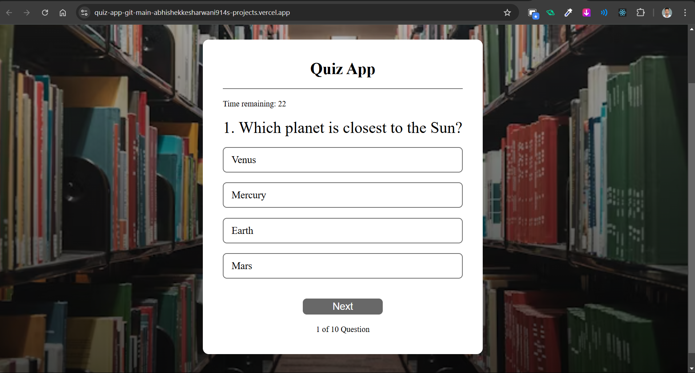

# **Quiz App**

It is a quiz app developed with few questions. It has so many features also.

## **Features**

- Quiz Creation & Management:

    - Displays multiple-choice questions.
    - It has a list of questions with options.
    - It has a list of questions with inputs.
    - Allows multiple attempts.
    - At end it allows the user to restart the quiz.
- User Interaction:

    - Users can select answers and receive instant feedback.
    - Implements a timer-based quiz (30 seconds per question).

- Progress Tracking:
    - Displays a scoreboard at the end of each quiz.
    - It keeps track of the score.

## **How to Run the App Locally**

**Prerequisites**

Ensure you have the following installed:
- Node.js (latest stable version)
- npm or yarn

**Steps to Run**

1. Clone the Repository
```bash
git clone https://github.com/abhishekkesharwani914/Quiz-App.git
cd quiz-app
```
2. Install Dependencies
```bash
npm install  # or yarn install
```
3. Run the App
```bash
npm run dev  # or yarn dev
```
4. Open in Browser
- The app should be running on http://localhost:3000 (or the port specified in the terminal).

## Image



## Deployment

- Modify the vite.config.js file if necessary to configure aliases correctly.
- The app is deployed on vercel.

## 🔗 Links

- [Project Github link](https://github.com/abhishekkesharwani914/Quiz-App)

- [Project live](https://quiz-app-git-main-abhishekkesharwani914s-projects.vercel.app/)

- [GitHub](https://github.com/abhishekkesharwani914)

- [linkedin](https://www.linkedin.com/in/abhishek-kesharwani-5019b4215/)
